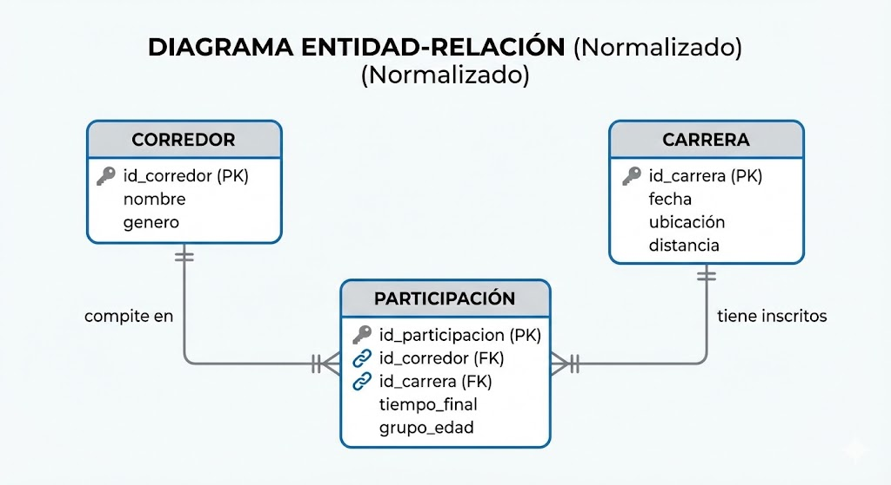

Modelo Lógico de Datos: Carreras y Resultados
Para entender cómo se estructuran los datos de nuestra aplicación, hemos definido un modelo Entidad-Relación (ER) normalizado. Este modelo divide la información en tres componentes clave para asegurar la integridad y evitar la redundancia.

Estructura del Diagrama
El modelo se divide en tres entidades principales:

Corredor:

Representa a la persona física que compite.

Atributos: Incluye un identificador único (id_corredor), el nombre completo y el género.

Carrera:

Representa el evento deportivo en una ubicación y fecha específicas.

Atributos: Identificador (id_carrera), fecha del evento, ubicación geográfica y la distancia total (ej. 7.5 km).

Objetivo: Centralizar la información del evento para que no varíe entre los participantes.

Participación:

Es la entidad "puente" que une a un corredor con una carrera.

Atributos: Aquí es donde vive la información dinámica, como el tiempo_final y el grupo_edad (ya que un corredor cambia de categoría de edad con el tiempo).

Relaciones: Tiene una relación de muchos a uno con Corredor y Carrera (una carrera tiene muchos participantes, y un corredor puede tener muchas participaciones).